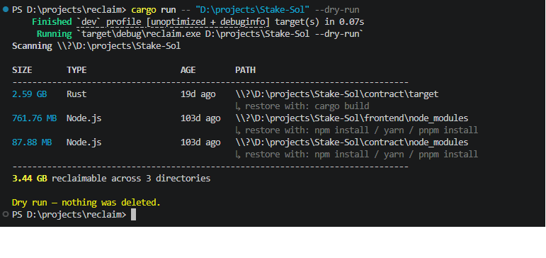

# reclaim

Find and clean up the disk space wasted by build artifacts, dependency
caches, and other junk that every developer accumulates: `node_modules`,
`target`, `.venv`, `__pycache__`, `.gradle`, Xcode `DerivedData`, and more —
all detected across an entire directory tree in seconds, all 100% safe to
delete because it's all regenerable.



```
$ reclaim ~/code

Scanning /home/you/code

SIZE       TYPE                   AGE        PATH
--------------------------------------------------------------------------------
2.1 GB     Node.js                12d ago    /home/you/code/webapp/node_modules
1.4 GB     Rust                   3d ago     /home/you/code/cli-tool/target
890 MB     Python venv            45d ago    /home/you/code/scraper/.venv
310 MB     Xcode DerivedData      2d ago     /home/you/code/ios-app/DerivedData
--------------------------------------------------------------------------------
4.70 GB reclaimable across 4 directories

Space to toggle, Enter to confirm deletion
> [x] 2.1 GB     Node.js                /home/you/code/webapp/node_modules
  [x] 1.4 GB     Rust                   /home/you/code/cli-tool/target
  [x] 890 MB     Python venv            /home/you/code/scraper/.venv
  [x] 310 MB     Xcode DerivedData      /home/you/code/ios-app/DerivedData

Freed: 4.70 GB
```

## Why

Every project you've ever cloned or built leaves behind gigabytes of
regenerable junk sitting untouched on disk: `npm install` output, `cargo
build` artifacts, virtualenvs, IDE caches. It builds up silently across
dozens of repos until your disk is full — and there's no easy way to see
where it all is or what's safe to delete.

`reclaim` scans a directory tree, recognizes these artifacts by name (with
sanity checks so it doesn't false-positive on generic folder names like
`build`), sizes them in parallel, and lets you pick exactly what to delete.
Nothing is ever removed without your say-so unless you pass `--yes`.

## Install

**From source** (requires Rust):

```sh
git clone https://github.com/yourname/reclaim
cd reclaim
cargo install --path .
```

**Prebuilt binaries**: see [Releases](../../releases) for Linux, macOS, and
Windows binaries.

## Usage

```sh
reclaim                    # scan the current directory
reclaim ~/code             # scan a specific directory
reclaim --dry-run          # scan and report only, never delete
reclaim --yes              # skip the picker, delete everything found
reclaim --min-size-mb 100  # only show artifacts 100 MB or larger
reclaim --json             # machine-readable output, e.g. for scripting
```

By default `reclaim` shows you everything it found above 1 MB, lets you
uncheck anything you want to keep in an interactive picker, and only
deletes what you confirm.

## What it detects

| Ecosystem | Directory | Regenerate with |
|---|---|---|
| Node.js | `node_modules` | `npm install` |
| Rust | `target` | `cargo build` |
| Python | `.venv`, `venv`, `__pycache__` | `pip install -r requirements.txt` |
| Gradle | `.gradle`, `build` | `./gradlew build` |
| Maven | `target` | `mvn package` |
| Xcode | `DerivedData` | rebuilds automatically |
| CocoaPods | `Pods` | `pod install` |
| .NET | `bin`, `obj` | `dotnet build` |
| Next.js | `.next` | `next build` |
| Nuxt | `.nuxt` | `nuxt build` |
| Terraform | `.terraform` | `terraform init` |
| Composer | `vendor` | `composer install` |
| Go | `vendor` | `go mod vendor` |
| Ruby (Bundler) | `.bundle` | `bundle install` |
| Elixir | `_build`, `deps` | `mix compile` / `mix deps.get` |
| Haskell (Stack) | `.stack-work` | `stack build` |
| Haskell (Cabal) | `dist-newstyle` | `cabal build` |
| Zig | `zig-cache`, `zig-out` | `zig build` |

Generic-sounding directories (`build`, `bin`, `obj`, `target`, `vendor`) are
only flagged when a matching project marker file sits next to them (e.g.
`target/` is only flagged as Rust build output if there's a `Cargo.toml`
right there), so `reclaim` won't touch an unrelated folder that happens to
share a common name.

Missing a detector for your favorite tool? Open an issue or send a PR — see
[`src/detectors.rs`](src/detectors.rs), adding one is a five-line change.

## Testing

```sh
cargo test              # unit tests (detector matching) + integration tests (full CLI)
cargo clippy --all-targets -- -D warnings
cargo fmt --check
```

The unit tests in `src/scanner.rs` cover the marker-matching logic directly
(the part most likely to misfire on an edge case). The integration tests in
`tests/cli.rs` build disposable temp directories, run the actual compiled
binary against them, and assert on real filesystem state afterward —
including the safety-critical case that a decoy `build/` directory with no
matching marker file is never touched. CI (`.github/workflows/ci.yml`) runs
the full suite on Linux, macOS, and Windows on every push.

## How it works

`reclaim` walks the target directory tree once, matching directory names
(and their sibling marker files) against a known list of build-artifact
patterns. It doesn't descend into a matched directory — no need, since the
whole thing is getting sized as one unit — which keeps the scan fast even
on deeply nested `node_modules` trees. Sizing is done in parallel across
all matches using [rayon](https://github.com/rayon-rs/rayon).

## Safety

- Nothing is deleted without confirmation unless you pass `--yes`.
- `--dry-run` never deletes anything, full stop, even combined with `--yes`.
- Only directories matching a known, regenerable-artifact pattern are ever
  shown — `reclaim` never does a generic "biggest files/folders" scan, so
  it can't surface something irreplaceable by accident.

As with any tool that deletes files, review the list before confirming.

## License

MIT
